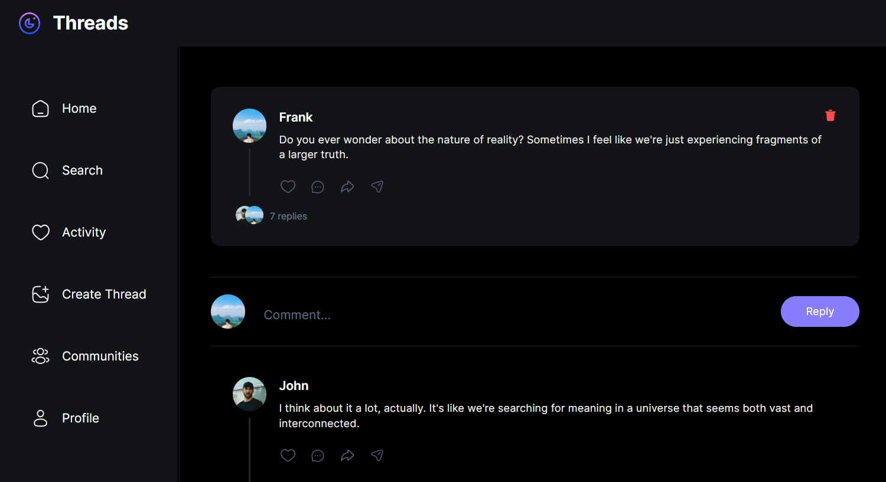

<div align="center">
    <a href="https://threads-fv.vercel.app" target="_blank">
      
    </a>
  <h3 align="center">Threads Clone</h3>
</div>

##  <br /> 📋 <a name="table">Table of Contents</a>

- ✨ [Introduction](#introduction)
- ⚙️ [Tech Stack](#tech-stack)
- 📝 [Features](#features)
- 🚀 [Quick Start](#quick-start)

##  <br /> <a name="introduction">✨ Introduction</a>

**[EN]** Full-stack Threads clone built on Next.js 14+. It includes comprehensive user interaction, community management functionalities, robust technical implementation, and a range of features like nested deep comments, notifications, real-time search, and more.

**[FR]** Clone de Threads en full-stack réalisé avec Next.js 14+. Ce projet comprend une interaction utilisateur approfondie, des fonctionnalités de gestion communautaire, une implémentation technique robuste, ainsi qu'une gamme de fonctionnalités telles que des commentaires imbriqués, des notifications, une recherche en temps réel, et bien plus encore.

##  <br /> <a name="tech-stack">⚙️ Tech Stack</a>

- **React** is a popular JavaScript library for building user interfaces, particularly single-page applications where data changes over time. React's component-based architecture allows developers to create reusable UI components, making development more efficient and the codebase easier to maintain. Its virtual DOM enhances performance by minimizing direct interactions with the browser's DOM.

- **Next.js** is a React framework known for its server-side rendering (SSR) and static site generation (SSG) capabilities, enhancing performance and SEO for web applications. It offers features like automatic code splitting, API routes for server-side logic, and a plugin system for extensibility.

- **TypeScript** is a statically typed superset of JavaScript that allows for early detection of errors and more robust, maintainable code. TypeScript's type system helps developers catch mistakes early during the development process, ensuring a more stable and reliable application.

- **Clerk** is an advanced authentication and user management service that provides secure and seamless user login, registration, and profile management. Clerk handles complex authentication flows, including multi-factor authentication (MFA), social logins, and passwordless authentication, making it easy to manage user identities while maintaining high security standards.

- **MongoDB** is a NoSQL database system known for its flexibility and scalability, ideal for handling large volumes of unstructured or semi-structured data. It stores data in JSON-like documents, making it easy to integrate with modern applications. MongoDB's features include powerful querying capabilities, automatic sharding for horizontal scaling, flexible data models, and support for distributed transactions in recent versions.

- **Webhooks** are automated messages sent from one application to another when specific events occur. They are typically triggered by events in a source application and deliver data in real-time to a target application via HTTP POST requests. Webhooks facilitate seamless integration between different systems, allowing for event-driven communication without continuous polling.

- **Serverless** APIs refer to backend services that run on cloud infrastructure, where the cloud provider dynamically manages the allocation and scaling of resources. Serverless APIs eliminate the need for developers to manage servers, enabling them to focus on writing code and delivering functionality. They are cost-effective, scalable, and ideal for handling unpredictable workloads or microservices architectures.

- **React Hook Form** is a lightweight library for managing forms in React applications. It simplifies form handling by leveraging React's Hooks API, offering a performant and intuitive way to manage form state, validation, and submission. React Hook Form emphasizes reusability, flexibility, and minimal boilerplate code, making it suitable for building complex forms efficiently.

- **Zod** is a TypeScript-first schema validation library that provides a robust and type-safe way to define data schemas and validate data against those schemas. It allows developers to declare data shapes using TypeScript's type system, ensuring type safety at compile-time. Zod supports advanced features like schema composition, custom error messages, and runtime validation, making it suitable for both frontend and backend validation needs.

- **Tailwind** is a utility-first CSS framework that speeds up UI development by providing a set of pre-built utility classes. It allows developers to quickly build custom designs without writing traditional CSS, promoting rapid prototyping and design consistency.

- **shadcn/ui** is as comprehensive React component library designed for creating modern and responsive user interfaces. ShadCN offers a wide range of pre-built, customizable components that adhere to best practices for accessibility and performance. Its intuitive API and well-documented components enable developers to build consistent and aesthetically pleasing UIs with ease.


## <br/> <a name="features">📝 Features</a>

👉 **Authentication**: Authentication using Clerk for email, password, and social logins (Google and GitHub) with a comprehensive profile management system.

👉 **Visually Appealing Home Page**: A visually appealing home page showcasing the latest threads for an engaging user experience.

👉 **Create Thread Page**: A dedicated page for users to create threads, fostering community engagement

👉 **Commenting Feature**: A commenting feature to facilitate discussions within threads.

👉 **Nested Commenting**: Commenting system with nested threads, providing a structured conversation flow.

👉 **User Search with Pagination**: A user search feature with pagination for easy exploration and discovery of other users.

👉 **Activity Page**: Display notifications on the activity page when someone comments on a user's thread, enhancing user engagement.

👉 **Profile Page**: User profile pages for showcasing information and enabling modification of profile settings.

👉 **Create and Invite to Communities**: Allow users to create new communities and invite others using customizable template emails.

👉 **Community Member Management**: A user-friendly interface to manage community members, allowing role changes and removals.

👉 **Admin-Specific Community Threads**: Enable admins to create threads specifically for their community.

👉 **Community Search with Pagination**: A community search feature with pagination for exploring different communities.

👉 **Community Profiles**: Display community profiles showcasing threads and members for a comprehensive overview.

👉 **Figma Design Implementation**: Transform Figma designs into a fully functional application with pixel-perfect and responsive design.

👉 **Blazing-Fast Performance**: Optimal performance and instantaneous page switching for a seamless user experience.

👉 **Server Side Rendering**: Utilize Next.js with Server Side Rendering for enhanced performance and SEO benefits.

👉 **MongoDB with Complex Schemas**: Handle complex schemas and multiple data populations using MongoDB.

👉 **File Uploads with UploadThing**: File uploads using UploadThing for a seamless media sharing experience.

👉 **Real-Time Events Listening**: Real-time events listening with webhooks to keep users updated.

👉 **Middleware, API Actions, and Authorization**: Utilize middleware, API actions, and authorization for robust application security.

👉 **Next.js Layout Route Groups**: New Next.js layout route groups for efficient routing

👉 **Data Validation with Zod**: Data integrity with data validation using Zod

👉 **Form Management with React Hook Form**: Efficient management of forms with React Hook Form for a streamlined user input experience.

## <br /> <a name="quick-start">🚀 Quick Start</a>

Follow these steps to set up the project locally on your machine.

<br/>**Prerequisites**

Make sure you have the following installed on your machine:

- [Git](https://git-scm.com/)
- [Node.js](https://nodejs.org/en)
- [npm](https://www.npmjs.com/) (Node Package Manager)

<br/>**Cloning the Repository**

```bash
git clone {git remote URL}
```

<br/>**Installation**

Let's install the project dependencies, from your terminal, run:

```bash
npm install
# or
yarn install
```

<br/>**Set Up Environment Variables**

Create a new file named `.env` in the root of your project and add the following content:

```env
# Clerk
NEXT_PUBLIC_CLERK_PUBLISHABLE_KEY=
CLERK_SECRET_KEY=
NEXT_CLERK_WEBHOOK_SECRET=
NEXT_PUBLIC_CLERK_SIGN_IN_URL=/sign-in
NEXT_PUBLIC_CLERK_SIGN_UP_URL=/sign-up
NEXT_PUBLIC_CLERK_AFTER_SIGN_IN_URL=/
NEXT_PUBLIC_CLERK_AFTER_SIGN_UP_URL=/onboarding

# MongoDB
MONGODB_URL=

# UploadThing
UPLOADTHING_SECRET=
UPLOADTHING_APP_ID=
```

Replace the placeholder values with your actual respective account credentials:

- [Clerk](https://dashboard.clerk.com)
- [MongoDB](https://cloud.mongodb.com)
- [Uploadthing](https://uploadthing.com/dashboard)


<br/>**Running the Project**

Installation will take a minute or two, but once that's done, you should be able to run the following command:

```bash
npm run dev
# or
yarn dev
```

Open [`http://localhost:3000`](http://localhost:3000) in your browser to view the project.
